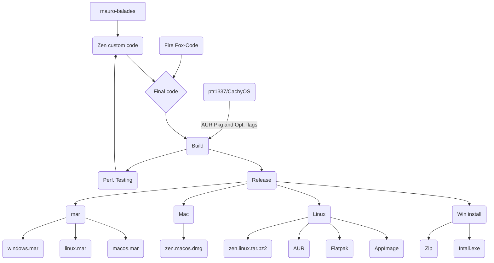
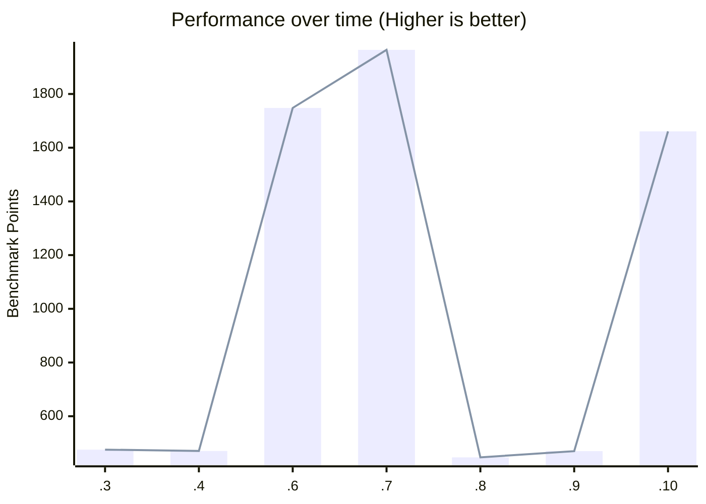

# 🌀 Zen Browser Performance traker

### Scores 

#### 1
- [NOCanoa ](https://github.com/NOCanoa)

OS: win 11
CPU: i5 13600k
https://www.tablesgenerator.com/
|           | score:  |CSS | HTML5 | Page load and Responsiveness | Resize Cap. |
|-----------|-----|-----|-------|------------------------------|-------------|
| 1.0.0-a.10 | 1660.89 | 59% | 91% | 91% | 76% |
| 1.0.0-a.9 | 470 |  why  | why  | why  | why  |
| 1.0.0-a.8 | 446.74  | 59% | 91%   | 96%                          | 76%         |
| 1.0.0-a.7 | 1964.43 | 59% | 91%   | 91%                          | 76%         |
| 1.0.0-a.6 | 1747.98 | 59% | 91%   | 91%                          | 76%         |
| 1.0.0-a.4 | 470.49  | 59% | 91%   | 97%                          | 76%         |
| 1.0.0-a.3 | 475.52  |59% | 91%   | 97%                          | 76%         |

https://browserbench.org

in a miuut xD

#### 2

- [Verix](https://github.com/Veriiix)

OS: Win 11
CPU: i7-13700KF
GPU: AMD RX 7900 XTX
https://www.tablesgenerator.com/

| Version    | Score: |
|------------|--------|
| 1.0.0-a.10 | 21.7   |
| 1.0.0-a.9  | 3.7    |

https://browserbench.org/Speedometer3.0/
