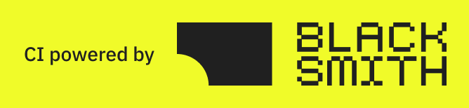

<!--
   - This Source Code Form is subject to the terms of the Mozilla Public
   - License, v. 2.0. If a copy of the MPL was not distributed with this
   - file, You can obtain one at http://mozilla.org/MPL/2.0/.
   -->
<!-- TODO: Get a job -->


### `Zen Browser`

[](https://github.com/zen-browser/desktop/releases)
[](https://crowdin.com/project/zen-browser)
[](https://github.com/zen-browser/desktop/actions/workflows/build.yml)

Zen is a firefox-based browser with the aim of pushing your productivity to a new level!

<div flex="true">
  <a href="https://zen-browser.app/download">
    Download
  </a>
  •
  <a href="https://zen-browser.app">
    Website
  </a>
  •
  <a href="https://docs.zen-browser.app">
    Documentation
  </a>
  •
  <a href="https://zen-browser.app/release-notes/latest">
    Release Notes
  </a>
</div>

### Firefox Versions

- [`Release`](https://zen-browser.app/download) - Is currently built using Firefox version `154.0.1`!
- [`Twilight`](https://zen-browser.app/download?twilight) - Is currently built using Firefox version `RC 154.0.1`!

### Contributing

If you'd like to report a bug, please do so on our [GitHub Issues page](https://github.com/zen-browser/desktop/issues/) and for feature requests, you can use [GitHub Discussions](https://github.com/zen-browser/desktop/discussions).

Zen is an open-source project, and we welcome contributions from the community! Please take a look at the [contribution guidelines](./docs/contribute.md) before getting started!

#### Partners

Thanks to all the partners of Zen for their support and contributions:

<a href="https://blacksmith.sh">
  
</a>

### Building and installing a local macOS build

This runbook builds the ARM64 app from source and replaces an existing DMG installation without replacing its profile. Zen stores profile data outside the app bundle at `~/Library/Application Support/zen/`.

#### First-time setup

Install GNU Tar, then install the Node dependencies and initialize the Firefox source tree:

```sh
brew install gnu-tar
npm ci
npm run init
```

Run `npm run init` once per checkout. It downloads and initializes the Firefox source and needs substantial disk space.

#### Build and package

Configure the release brand and build mode:

```sh
npm run surfer -- config brand release
npm run surfer -- config buildMode release
```

Build with the local macOS settings:

```sh
ZEN_RELEASE=1 ZEN_GA_DISABLE_PGO=1 ZEN_DISABLE_LTO=1 npm run build
npm run package
```

For JavaScript-only changes after the first full build, `npm run build:ui` can be used instead of `npm run build`. Use the full build for native or core changes.

#### Choosing a build target

Before rebuilding, inspect the complete working tree, including staged and untracked files:

```sh
git status --short
git diff --name-only
git diff --cached --name-only
```

Use `npm run build:ui` only when the changes are limited to JavaScript in the UI layer. Use the full `npm run build` for changes to C++, Objective-C or Objective-C++, headers, Rust, Cargo files, build configuration, dependencies, Firefox versions, or any mixed or uncertain change set.

If the Firefox source tree was recreated or is missing, run `npm run init` again. If patch files or generated preferences changed after initialization, rerun the relevant import step before building. When in doubt, use the full build.

#### Compare the installed build with the source

Zen records the source repository and commit SHA in the installed app. Compare that SHA with the checkout before rebuilding:

```sh
installed_app="/Applications/Zen.app"
test -f "$installed_app/Contents/Resources/application.ini"
installed_sha="$(awk -F= '$1 == "SourceStamp" { print $2; exit }' "$installed_app/Contents/Resources/application.ini")"
source_sha="$(git rev-parse HEAD)"

test -n "$installed_sha"
git cat-file -e "$installed_sha^{commit}"
printf 'Installed build: %s\nSource checkout: %s\n' "$installed_sha" "$source_sha"
git log --oneline "$installed_sha..$source_sha"
git diff --stat "$installed_sha..$source_sha"
```

Use `git diff "$installed_sha..$source_sha"` to inspect the committed changes between builds. Also inspect local changes because the embedded SHA does not include uncommitted or untracked files:

```sh
git status --short
git diff "$installed_sha"
git diff --cached
git ls-files --others --exclude-standard
```

If the installed SHA is not present in the local repository history, fetch the required history before running the comparison. Use the changed files and their contents to decide between `npm run build:ui` and a full build.

#### Back up the profile and replace the app

Quit every Zen window before copying the profile or replacing the app. Create a backup before each replacement:

```sh
profile_backup="$HOME/Desktop/zen-backup-$(date +%Y-%m-%d-%H%M%S)"
test ! -e "$profile_backup"
ditto "$HOME/Library/Application Support/zen" "$profile_backup"
```

The packaged ARM64 app is at `engine/obj-aarch64-apple-darwin/dist/Zen.app`. Install it while keeping the previous app as a rollback copy:

```sh
set -e
app="engine/obj-aarch64-apple-darwin/dist/Zen.app"
staged="/Applications/Zen.app.new"
previous="/Applications/Zen.app.backup-$(date +%Y-%m-%d-%H%M%S)"

test -d "$app"
test ! -e "$staged"
test ! -e "$previous"
ditto "$app" "$staged"

if [ -e /Applications/Zen.app ]; then
  mv /Applications/Zen.app "$previous"
fi
mv "$staged" /Applications/Zen.app
open -a /Applications/Zen.app
```

After launch, check `about:profiles` if Zen appears to be a fresh install. Select the existing profile rather than deleting or copying over profile files. The local app is unsigned, so macOS may require opening it through Control-click > Open, and automatic updates may not work.

#### Troubleshooting

If initialization reports that GNU Tar is required, install it with `brew install gnu-tar` and rerun `npm run init`. If a release build reports that no adequate linker was found, use the `ZEN_RELEASE=1 ZEN_GA_DISABLE_PGO=1 ZEN_DISABLE_LTO=1` build command above. An `engine/.git/index.lock` warning can occur during Firefox source initialization; wait for any active Git process to finish before removing a stale lock or retrying.
