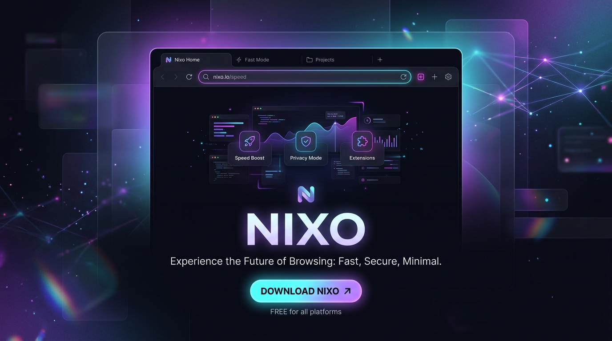
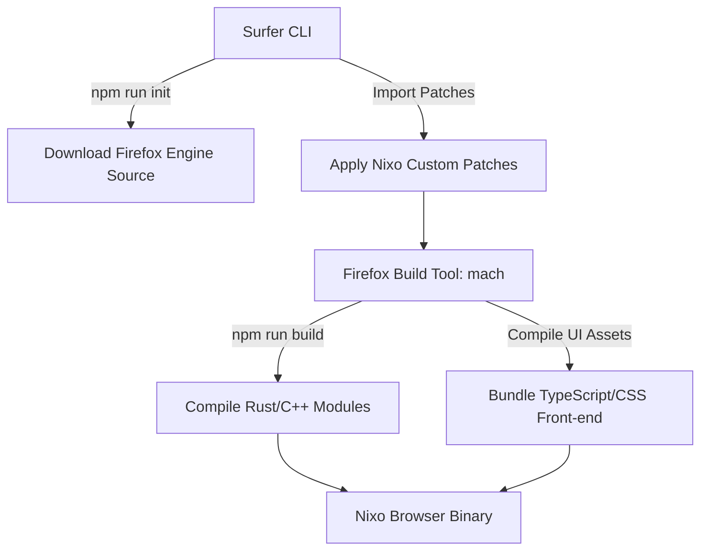

<!--
   - This Source Code Form is subject to the terms of the Mozilla Public
   - License, v. 2.0. If a copy of the MPL was not distributed with this
   - file, You can obtain one at http://mozilla.org/MPL/2.0/.
   -->
<!-- TODO: Get a job -->

<p align="center">
  
</p>

<p align="center">
  <a href="https://github.com/nixo-browser/nixo/releases">
    
  </a>
  <a href="https://crowdin.com/project/nixo-browser">
    
  </a>
  <a href="https://github.com/nixo-browser/nixo/actions/workflows/build.yml">
    
  </a>
  <a href="https://github.com/nixo-browser/nixo/blob/main/LICENSE">
    
  </a>
</p>

<p align="center">
  <a href="https://nixo.app/download">
    
  </a>
  <a href="https://nixo.app">
    
  </a>
  <a href="https://docs.nixo.app">
    
  </a>
  <a href="https://nixo.app/release-notes/latest">
    
  </a>
</p>

---

## Overview

**Nixo** is an open-source, community-focused web browser built as a modern, high-productivity fork of the **Zen Browser**. Powered by the core **Mozilla Firefox** engine, Nixo maintains maximum compatibility with standard web extensions while introducing a redefined, minimalist UI designed for multitasking.

Nixo removes web clutter, secures your online privacy by default, and introduces layout mechanics like workspaces, vertical sidebars, and customizable stylesheets to put the browser's form and function entirely under your control.

---

## Key Capabilities

*   **Collapsible Sidebar Layout**: Say goodbye to crowded tabs. Nixo displays vertical tabs on a clean, dynamic side-panel that can be pinned, collapsed, or hidden in Compact Mode.
*   **Context-Based Workspaces**: Separate your online life into isolated workspaces (e.g., Development, Social, Travel) to keep tabs grouped and organized.
*   **Privacy-First Architecture**: No third-party telemetry, tracking protection enabled by default, and sandboxed execution of web processes.
*   **Extensive Themes (Mods)**: Nixo natively parses CSS overrides, allowing you to custom skin scrollbars, borders, active tab highlight effects, and UI elements.
*   **Hardened Performance**: Optimized memory allocation strategies and inactive-tab hibernation ensure your system resources are allocated where they are needed most.

---

## Build Architecture

Nixo wraps the Firefox source engine with custom patches and UI modifications. The build workflow utilizes the `@zen-browser/surfer` utility and the standard Firefox `mach` command-line tool.



---

## Getting Started

Building Nixo from source allows you to contribute modifications and debug UI behaviors locally.

### Prerequisites

Please ensure your build environment has:
*   **30 GB+** of free disk space.
*   **Node.js** (version `v21+`).
*   **Python 3** (version `3.10+`).
*   **Rust & Cargo** (latest toolchain).

### Step-by-Step Build Guide

1. **Clone the repository:**
   ```bash
   git clone https://github.com/nixo-browser/nixo.git
   cd nixo
   ```

2. **Install project dependencies:**
   ```bash
   npm install
   ```

3. **Initialize the local engine environment:**
   This command pulls the target Firefox base code, imports localization strings, and configures the environment:
   ```bash
   npm run init
   ```

4. **Compile the UI and engine resources:**
   ```bash
   npm run build
   ```

5. **Launch Nixo Browser:**
   Run the newly compiled executable instance:
   ```bash
   npm run start
   ```

---

## Development & Release Lifecycle

To maintain high development velocity alongside security updates, Nixo utilizes a multi-branch release pattern:

```
dev (Active development branch)
 │
 ├───> stable (Release branch)
 │       ^
 │       └─── Hotfix (Direct hotfixes for security/stability issues)
 │
 └───> twilight (Experimental feature testing branch)
```

*   `dev`: The default branch where all new features are integrated.
*   `stable`: Production-grade builds aligned with standard Firefox release increments.
*   `twilight`: Canary-style builds utilizing early beta releases of Firefox.

---

## Localization

Nixo uses Crowdin to make translations accessible to everyone globally. We welcome localization contributions!

👉 **[Translate Nixo on Crowdin](https://crowdin.com/project/nixo-browser)**

---

## Contributing

Contributions are what make the open-source community an amazing place. 

1. Review the [Contribution Guidelines](./docs/contribute.md).
2. Check the [Code of Conduct](./CODE_OF_CONDUCT.md).
3. If you find a bug, open an issue on the [GitHub Issues](https://github.com/nixo-browser/nixo/issues) board.
4. For feature ideas and community help, check [GitHub Discussions](https://github.com/nixo-browser/nixo/discussions).

---

## Partners & Support

A massive thank you to our partners for supporting Nixo:

<a href="https://blacksmith.sh">
  
</a>

---

## License

This project is licensed under the **Mozilla Public License 2.0 (MPL-2.0)**. Refer to the [LICENSE](./LICENSE) file for more information.
