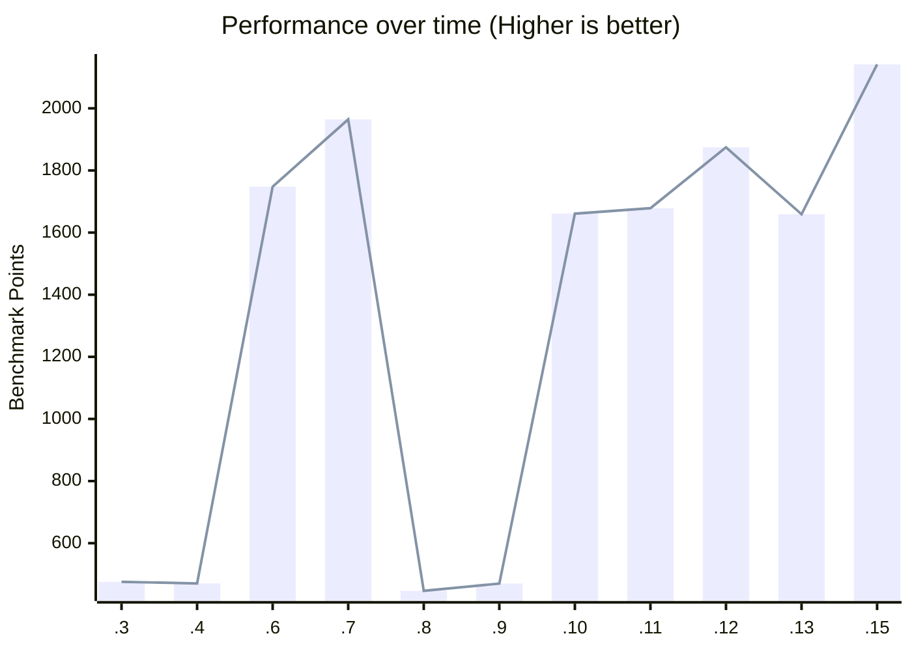
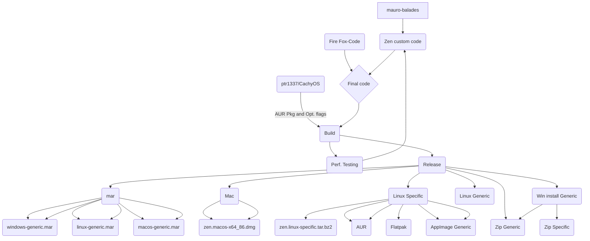

# 🌀 Zen Browser Performance traker

## Scores 

## 1
- [NOCanoa](https://github.com/NOCanoa)

OS: win 11; CPU: i5 13600k

## web.basemark

https://web.basemark.com/

|           | score:  |CSS | HTML5 | Page load and Responsiveness | Resize Cap. |
|-----------|-----|-----|-------|------------------------------|-------------|
| 1.0.0-a.15-opt | 2141.63 | 59% | 91% | 90% | 76% |
| 1.0.0-a.13-opt | 1658.87 | 59% | 91% | 90% | 76% |
| 1.0.0-a.12-opt | 1874.49 | 59% | 91% | 91% | 76% |
| 1.0.0-a.11-opt | 1678.49 | 59% | 91% | 91% | 76% |
| 1.0.0-a.10 | 1660.89 | 59% | 91% | 91% | 76% |
| 1.0.0-a.9 | 470 |  why  | why  | why  | why  |
| 1.0.0-a.8 | 446.74  | 59% | 91%   | 96%                          | 76%         |
| 1.0.0-a.7 | 1964.43 | 59% | 91%   | 91%                          | 76%         |
| 1.0.0-a.6 | 1747.98 | 59% | 91%   | 91%                          | 76%         |
| 1.0.0-a.4 | 470.49  | 59% | 91%   | 97%                          | 76%         |
| 1.0.0-a.3 | 475.52  |59% | 91%   | 97%                          | 76%         |
| other | last | utpdate | 31/7   | 2024                         | -        |
| Librewolf 128.0-2 | 1953.65 | 59.66% | 89.01%   | 91.72%                         | 76.12% |
| FF nightly 130.0a1 | 1912.77 | 59.66% | 90.91%   | 91.72%                         | 76.12% |

## Speedometer3.0

https://browserbench.org/Speedometer3.0/ 

|           | score:  |
|-----------|-----|
| 1.0.0-a.15-opt | TODO   |
| 1.0.0-a.13-opt | 21.1   |
| 1.0.0-a.12-opt | 21.5   |
| 1.0.0-a.11-opt | 20.8   |
| 1.0.0-a.10 | 21.2 |
| others| - |
| Vivaldi 6.7.3329.39| 27.8 |
| FF nightly 130.0a1 | 27.0 |
| Librewolf 128.0-2 | 20.2 |

## Repository View Counter

 <small><a href='https://www.websitecounterfree.com' title="Free Website Counter">Free Website Counter</a></small>

